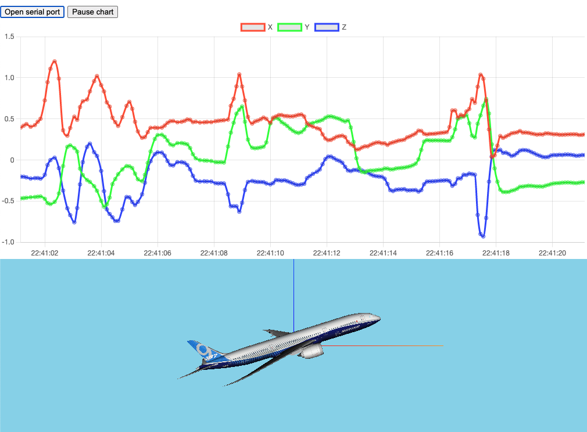

# WebSerialChart
Web Serial, Chart.js, Three.js sample
## Overview
This software gets the USB Serial data and show the real-time chart on the web browser.
This is a sample code for checking implimentation and the work of IMU via USB serial.

## Screenshot

## What is this
We use [Web Serial API](https://wicg.github.io/serial/) to get serial data on the web, [Chart.js](https://www.chartjs.org/) and [chartjs-plugin-streaming](https://nagix.github.io/chartjs-plugin-streaming/) to show the chart.
## Device to output serial data
We tested to measure IMU data output from [Atom Matrix](https://docs.m5stack.com/#/en/core/atom_matrix). The original source code is [here](https://github.com/m5stack/M5Atom/edit/master/examples/Basics/MPU6886/MPU6886.ino).

### Data format
The USB Serial format should be Euler(XYZ-order,"%f,%f,%f¥n") or Quaternion("%f,%f,%f,%f¥n").

## License
* Our software is licensed under GPLv2.
* We use Three.js ver.1.0.8.
* Included aircraft 3D model "b789.gib" is derived from [Flightradar24 3D models](https://github.com/Flightradar24/fr24-3d-models) which is licensed under GPLv2.
